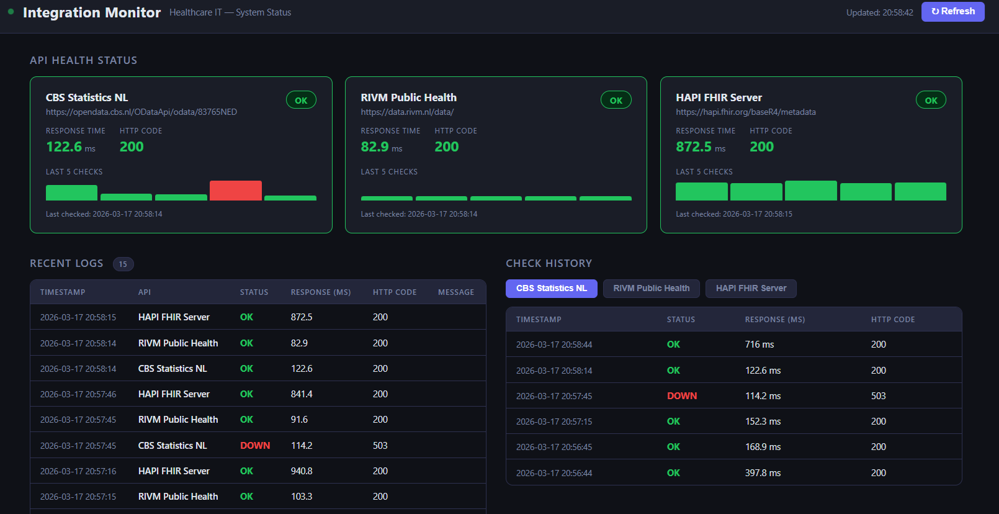

# Integration Monitoring & Alert System

A healthcare IT integration monitoring dashboard that simulates a real-world hospital environment — tracking external API health in real time with alerting, logging, and a live color-coded dashboard.



---

## Monitored APIs

| API | Endpoint | Role |
|-----|----------|------|
| CBS Statistics NL | `opendata.cbs.nl` | Government statistics data feed |
| RIVM Public Health | `data.rivm.nl` | Dutch epidemiology & public health |
| HAPI FHIR Server | `hapi.fhir.org/baseR4` | HL7 FHIR R4 — clinical interoperability standard |

---

## Features

- **Real-time health checks** — polls all APIs every 30 seconds
- **Status classification** — `OK` / `SLOW` / `DOWN` with color-coded cards
- **Retry mechanism** — retries failed requests 2× before marking DOWN
- **Live alert banner** — appears instantly when an API degrades or goes down, clears on recovery
- **Sparkline history** — visual bar chart of the last 10 checks per API
- **Dual-channel logging** — rotating file log + in-memory buffer served to the UI
- **Auto-refreshing dashboard** — no page reload needed, updates every 30 seconds

---

## Status Classification

| Status | Condition |
|--------|-----------|
| `OK` | HTTP 200 and response time ≤ 2000 ms |
| `SLOW` | HTTP 200 but response time > 2000 ms |
| `DOWN` | Non-200 response, timeout, or connection error (after retries) |

---

## Architecture

```
API_Dashboard/
├── app.py              # Flask app — routes and server entry point
├── monitor.py          # Monitoring engine — health checks, retry logic, alert management
├── logger.py           # Dual-channel logger (rotating file + in-memory ring buffer)
├── config.py           # Central configuration (APIs, thresholds, intervals)
├── templates/
│   └── dashboard.html  # Dashboard UI (Jinja2 template)
├── static/
│   ├── style.css       # Dark theme, color-coded CSS
│   └── script.js       # Polling client — fetch(), sparklines, alert rendering
├── logs/
│   └── monitor.log     # Rotating log file (auto-created on first run)
└── requirements.txt
```

### How it works

1. On startup, Flask runs an **immediate health check cycle** so the dashboard is never empty on first load.
2. A **background daemon thread** repeats the cycle every 30 seconds.
3. Each check sends an HTTP GET, measures response time, classifies status, and stores the result in shared memory (thread-safe).
4. Failed requests are **retried up to 2 times** with a delay before marking DOWN.
5. **Alerts** are raised when status becomes SLOW or DOWN, and automatically cleared on recovery.
6. All results are written to a **rotating log file** (`logs/monitor.log`, max 2 MB × 5 files) and an **in-memory buffer** (last 200 entries) served to the dashboard.
7. The frontend polls `/api/status`, `/api/alerts`, `/api/logs`, and `/api/history/<name>` every 30 seconds via `fetch()`.

---

## Quick Start

### 1. Clone the repository

```bash
git clone https://github.com/nkratastr/integration-monitor.git
cd integration-monitor
```

### 2. Create a virtual environment

```bash
python -m venv venv
source venv/bin/activate        # Windows: venv\Scripts\activate
```

### 3. Install dependencies

```bash
pip install -r requirements.txt
```

### 4. Run the application

```bash
python app.py
```

### 5. Open the dashboard

Navigate to [http://localhost:5000](http://localhost:5000)

---

## Configuration

All settings live in `config.py` — no code changes needed for tuning:

```python
SLOW_THRESHOLD_MS      = 2000   # response time above this → SLOW
TIMEOUT_SECONDS        = 10     # per-request HTTP timeout
CHECK_INTERVAL_SECONDS = 30     # background polling interval
RETRY_ATTEMPTS         = 2      # retries before marking DOWN
HISTORY_SIZE           = 10     # check results stored per API
MAX_LOG_ENTRIES        = 200    # in-memory log buffer size
```

---

## REST API Endpoints

| Endpoint | Method | Description |
|----------|--------|-------------|
| `/` | GET | Dashboard UI |
| `/api/status` | GET | Latest check result for all APIs |
| `/api/alerts` | GET | Currently active alerts |
| `/api/logs` | GET | Most recent 50 log entries |
| `/api/history/<api_name>` | GET | Last 10 checks for a specific API |

---

## Log Files

Logs are written to `logs/monitor.log` with automatic rotation.

```
2026-03-17 20:56:44 | INFO     | [CBS Statistics NL] status=OK | response_time=397.8 ms | http_code=200
2026-03-17 20:56:44 | INFO     | [RIVM Public Health] status=OK | response_time=87.9 ms | http_code=200
2026-03-17 20:56:45 | INFO     | [HAPI FHIR Server] status=OK | response_time=865.3 ms | http_code=200
2026-03-17 20:56:45 | WARNING  | ALERT | [CBS Statistics NL] DOWN — HTTP 404
```

---

## Remote Access (ngrok)

To access the dashboard from a mobile device or share it during a demo:

```bash
ngrok http 5000
```

ngrok provides a public HTTPS URL (e.g. `https://abc123.ngrok.io`) accessible from any device.
